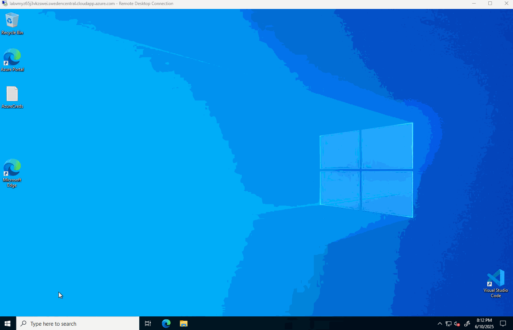
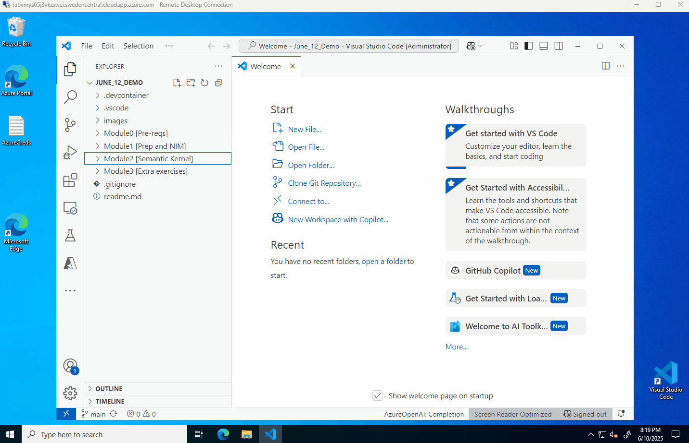

# Introduction

Normally, all the pre-requisites should be installed on the VM that is available in the Lab environment
If it is not the case, follow the steps below to install the necessary tools and extensions. 

## Install VSCODE and some extensions

1. Install VSCODE, if not already installed.
    ```
    winget install --id Microsoft.VisualStudioCode --source winget --accept-package-agreements  --accept-source-agreements
    ```
   If `winget` is not installed. Download VS Code manually and install it https://code.visualstudio.com/download


2. Open the project in VS Code (Repo URL: https://aka.ms/WintercircusAiHack)

    Here you have two options:

    * **Clone** the repository locally on the Lab VM
       ```
       git clone git@github.com:jgezelscorp/June_12_Demo.git
       ```
    * You can use ***codespaces***
       ```
           1. Open a browser on the lab VM
           2. Point to the repo
           3. Launch a code space
       ```
       

    
3. Install VSCODE Extensions (Open bash terminal in VSCODE, see additional tip)

    ```
    chmod +x install-vscode-and-extensions.sh
    ./install-vscode-and-extensions.sh
    ```

---

## Addition Tips:
Open Project in VSCODE



Open a bash terminal and install the extensions
