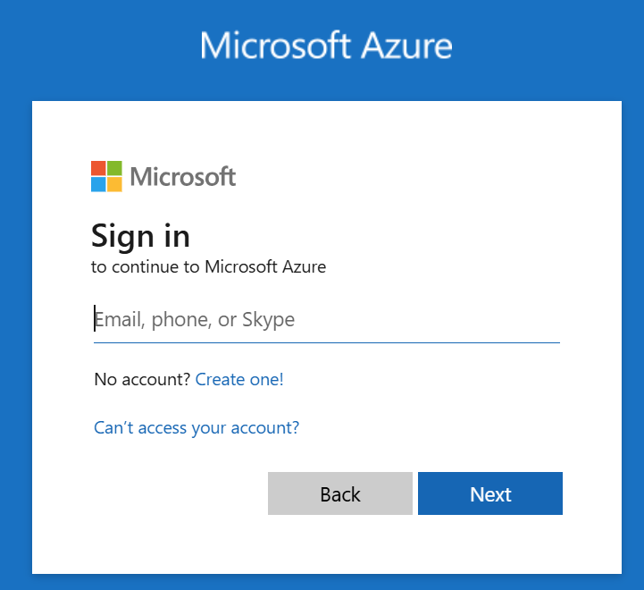
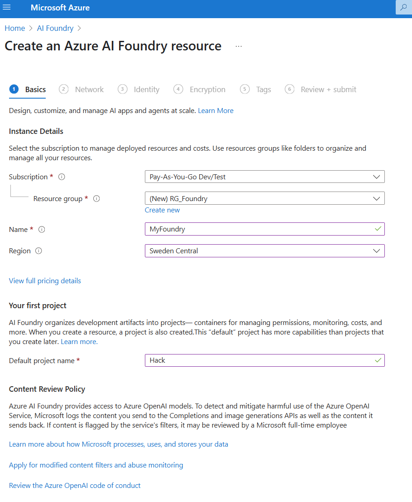
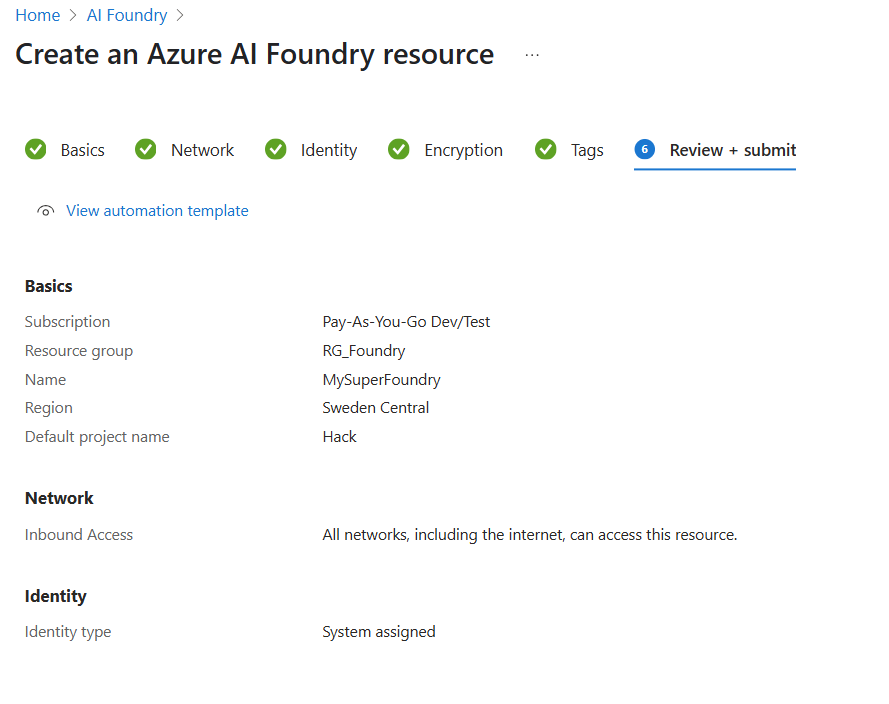
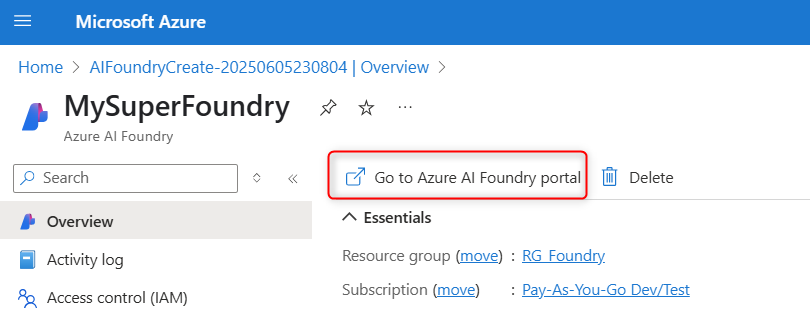
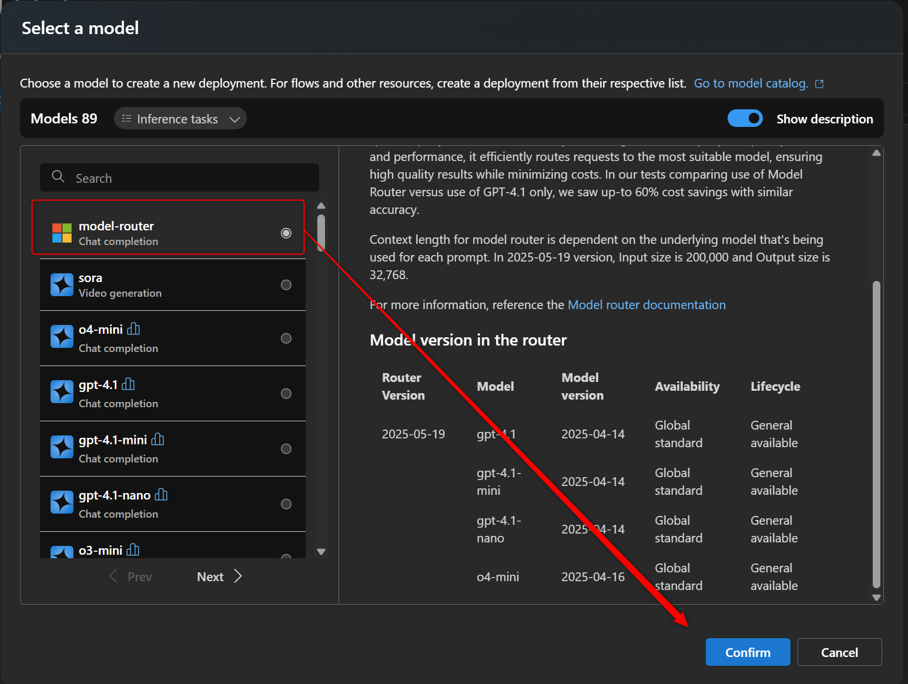
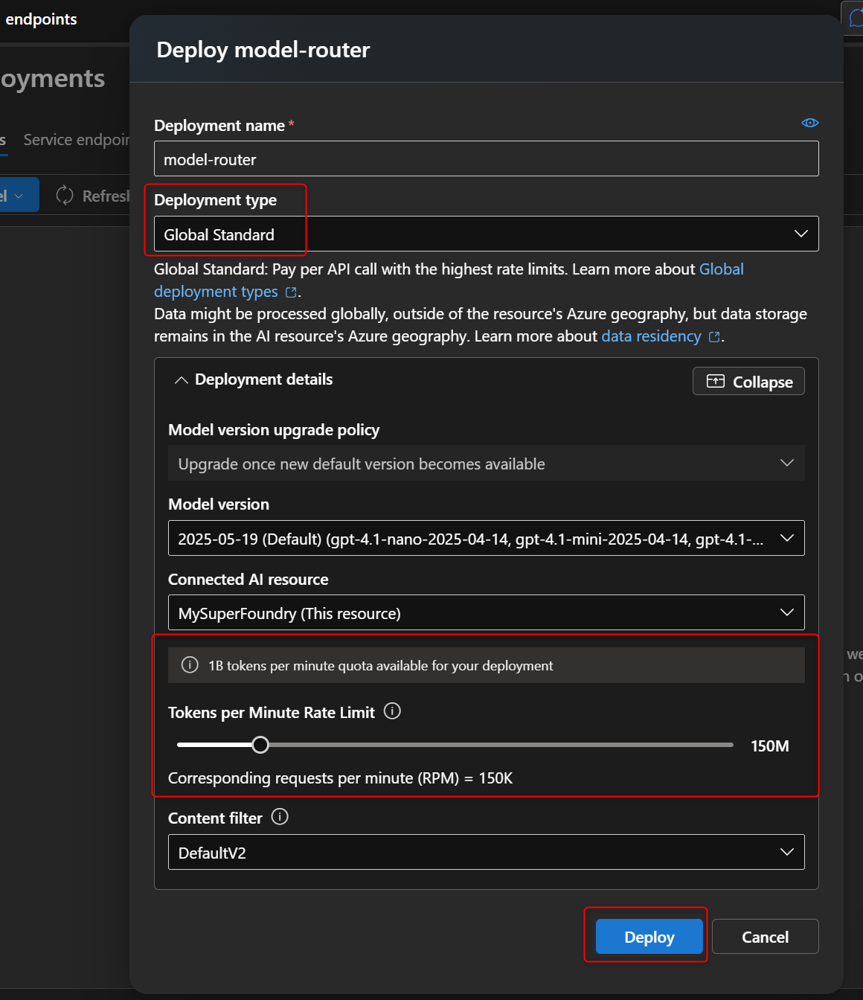

# Azure AI Foundry

In this step, we'll setup AI Foundry where we will deploy and configure our models. As far as LLMs go, we're going to do something special.
 

We are going to deploy **model Router** which consist of 
1. **GPT-4.1**
2. **GPT-4.1 Nano**
3. **GPT-4.1 Mini**

These models will be deployed behind an API Endpoint and the router will select the most optimal model to be used.

By using Model Router, we are able to achieve a 60% cost reduction while preserving almost the same accuracy as if we would only use GPT-4.1

For Embedding, we'll deploy the ADA-2 model.

## Log-in

Use the account that your coach has given you

Select "No" when asked to keep being signed in

Once logged in, type "AI Foundry" in the search bar, select it and create a resource

* Create a Resource Group
* Give the Foundry Resource a name
* Select ***Sweden Central*** as a region
* Give your first project a name
 

Leave all the reset as-is. Remember that you could use
private endpoints and other features to protect your resources which you typicaly would do in a production environment.

Once deployed, go to your Resource (AI Foundry instance) and click ***Go To AI Foundry Portal***

## AI Foundry

Once you are in foundry, make sure you are in the project.
In there, we'll have to note down some information

In the overview tab, do the following:
1. Copy the ***API Key***
2. Click on ***Azure OpenAI***
3. Copy the ***OpenAI endpoint***

Next, let's deploy our LLM. Remember, we'll be using ***Model-Router*** in our setup so:
1. go to ***Models & Endpoints***
2. Click the ***Deploy base model*** 

3. look for ***Model-Router***
4. Click ***Confirm***

You'll notice that for ***Model-Router***, there is currently only a ***Global Standard*** deployment type meaning that Microsoft will choose where inferencing is happening. 

This could be outside of Europe so be aware. For our hack, this doesn't really matter and as a result we get a lot of ***TPM*** & ***RPM***

***Repeat this step for ADA-2 & any other model you want to deploy***

